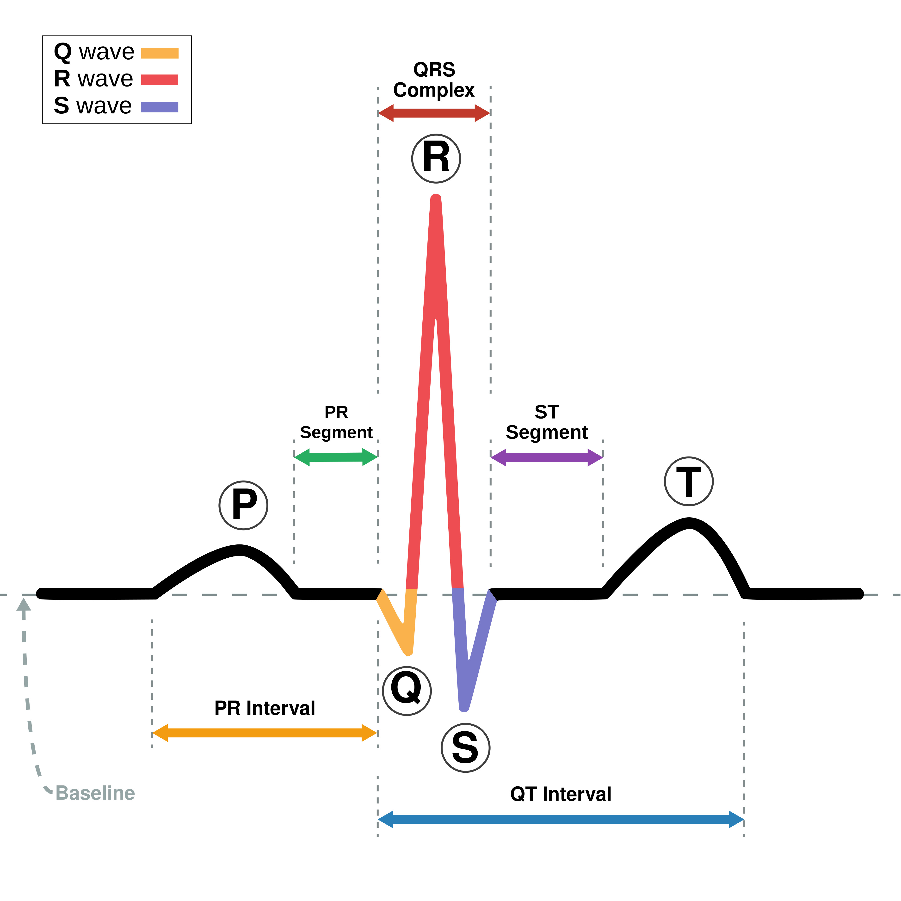

# ECG Data Compression and Reconstruction Project

__Date:__ August 7, 2024

__Author:__ Francesco Rosnati  
__Course:__ Numerical Analysis for Machine Learning @ Politecnico di Milano -- Professor Edie Miglio

    

## Project Overview

This project aims to develop Python software for ECG data compression and reconstruction, focusing on evaluating the effectiveness of the Kronecker technique in compressed sensing (CS) and comparing the performance of fixed dictionaries versus adaptive dictionary learning methods. The project is currently in its conceptual stage, with initial planning documents created.

## Planned Features

### Processing/Compression

1. __CS-Based Compressor with Fixed Dictionary__
   - __Purpose:__ To compress ECG data using compressed sensing with a fixed dictionary.
   - __Future Implementation:__ Implement compression using CS, applying the Kronecker technique to improve compression efficiency.

2. __CS-Based Compressor with Adaptive Dictionary Learning__
   - __Purpose:__ To compress ECG data using compressed sensing with adaptive dictionary learning.
   - __Future Implementation:__ Implement adaptive dictionary learning methods and evaluate their effectiveness when combined with the Kronecker technique.

### Reconstruction

1. __Reconstruction for CS-Based Compression__
   - __Purpose:__ To reconstruct ECG data from CS-based compressed measurements.
   - __Future Implementation:__ Implement reconstruction methods such as Basis Pursuit, Greedy algorithms, and smooth-L0, testing their performance with both fixed and adaptive dictionaries.

### Evaluation of Results

1. __Qualitative Assessment__
   - __Purpose:__ To evaluate the quality of reconstructed ECG data.
   - __Future Implementation:__ Use visualization tools, like matplotlib, to compare original and reconstructed signals.

2. __Quantitative Assessment__
   - __Purpose:__ To measure the performance of compression and reconstruction.
   - __Future Implementation:__ Develop metrics to evaluate the compression rate, algorithm complexity, processing speed, PRD, and SNR, particularly focusing on the comparison between the Kronecker technique and standard methods, as well as fixed versus adaptive dictionaries.

## Data Source

The ECG data used in this project will be sourced from the [MIT-BIH Arrhythmia Database](https://physionet.org/content/mitdb/1.0.0/), available on PhysioNet.
